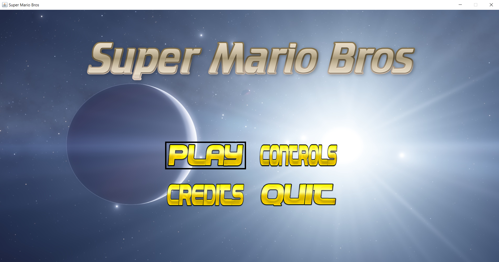
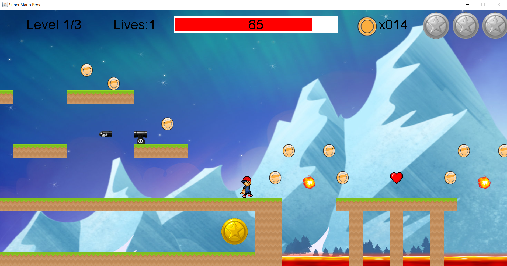

# Super Mario Bros

Super Mario Bros platformer game remake using Java! ([Demo Video](https://youtu.be/Vowxk0cRR60))

By [Cameron Beneteau](https://github.com/CameronBeneteau) and [Jack Li](https://github.com/jackli10345)  
Course: Computer Science ICS4U (Grade 12)  
Date: June 16th, 2018  
Grade: 100%

## Table of Contents
[1. Intro](#Intro)  
[2. Gameplay](#Gameplay)  
[3. Environment Setup](#Environment-Setup)  
[4. How to Play](#How-to-Play)  
[5. Results](#Results)  
[6. Next Steps](#Next-Steps)

## Intro

This is a single-player platformer game inspired by the classic arcade game [Super Mario Bros](https://en.wikipedia.org/wiki/Super_Mario_Bros.).

It was made using Java. It utilizes object-oriented programming and other ICS4U computing techniques.

## Gameplay

Check out the demo video for this project [here](https://youtu.be/Vowxk0cRR60)!

  

## Environment Setup

To successfully run this project, please follow these steps to set up your environment:

1. Any IDE that runs Java (we recommend [IntelliJ IDEA](https://www.jetbrains.com/idea/), [JCreator](https://www.deepcrazyworld.com/how-to-download-jcreator-pro/) or [VS Code](https://code.visualstudio.com/download))
2. Java SE 8 (which includes JDK 1.8.0_333) ([Download from Oracle](https://www.oracle.com/java/technologies/javase/javase8u211-later-archive-downloads.html))
3. Ensure your IDE is configured to use the above version of Java SE and JDK

## How to Play

All instructions can be found in the game by navigating to the "Controls" tab on the main menu.

Run the [main.java](main.java) file to play!

## Results

All-in-all, the project was a great success! We had an enjoyable time developing this game while learning Java and object-oriented programming.

Even better: Our classmates and teachers also competed to see who could finish our game the fastest!

**Grade: 100%**

## Next Steps
Some fun things we would like to build on or explore relating to this project would be:

- More diverse set of enemies
- Intelligent enemies that jump, attack, etc.
- Add a story line including more levels and various themes 
- Add sounds effects to various in-game events (coin pickup, death, etc.)
- Ability for players to choose different characters
